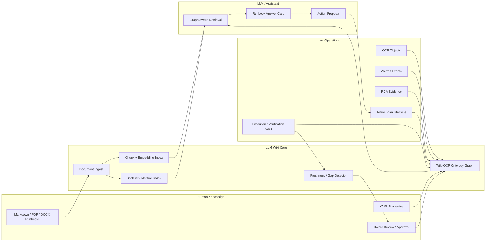

# AIOps for OCP v0.2.8 LLM Wiki Agent Plan

Ref stamp: `feature/v0.2.8-llm-wiki-design` from `4777496`
Date: 2026-07-04
Scope: design only; no company server deployment.

## 1. Goal

현재 AIOps for OCP에는 `위키 문서 관리` 메뉴가 있고, Gateway에는 RAG 문서 업로드/검색/ACL/pgvector 흐름이 있다. 그러나 현재 제품 경험은 아직 "문서를 올리고 검색하는 저장소"에 가깝다.

v0.2.8의 목표는 Wiki를 다음 수준으로 정의하는 것이다.

```text
운영자가 쓴 Runbook과 사내 문서
  + OpenShift/OCP의 실제 객체 상태
  + RCA 근거와 이벤트
  + Action Plan 승인/실행/검증 기록
  = LLM이 안전하게 추론할 수 있는 운영 지식 그래프
```

즉, Wiki는 챗봇의 보조 자료가 아니라 AIOps의 두 번째 뇌가 되어야 한다. 문서는 사람이 읽을 수 있어야 하고, 동시에 시스템이 객체/관계/실행조건으로 이해할 수 있어야 한다.

## 2. External Principles To Absorb

### 2.1 Palantir Principle - Ontology As Operational World Model

Sources:

- Palantir Ontology overview: https://www.palantir.com/docs/foundry/ontology/overview/
- Palantir Ontology core concepts: https://www.palantir.com/docs/foundry/ontology/core-concepts
- Palantir Action types: https://www.palantir.com/docs/foundry/action-types/overview/
- Palantir AIP overview: https://www.palantir.com/docs/foundry/aip/overview/
- Palantir object permissioning: https://www.palantir.com/docs/foundry/object-permissioning/overview
- Palantir data lineage: https://www.palantir.com/docs/foundry/data-lineage/overview
- Palantir workflow lineage: https://www.palantir.com/docs/foundry/workflow-lineage/overview
- Palantir AIP architecture: https://www.palantir.com/docs/foundry/architecture-center/aip-architecture

Palantir에서 배울 핵심은 예쁜 그래프가 아니다. 운영 세계를 `명사와 동사`로 고정하는 방식이다.

- Object type: 실제 세계의 엔티티 또는 이벤트.
- Link type: 객체 사이의 관계.
- Action type: 사용자가 승인하고 실행할 수 있는 변경.
- Role/permission: 객체, 링크, 액션에 대한 접근 통제.
- Function: 객체와 액션 위에서 동작하는 계산/검증 로직.

AIOps에 적용하면 다음처럼 바뀐다.

| Palantir 개념 | AIOps 적용 |
| --- | --- |
| Object type | Cluster, Namespace, Node, Operator, Deployment, Pod, Alert, Incident, Runbook, ActionPlan |
| Link type | `owns`, `runs_on`, `affected_by`, `explained_by`, `remediated_by`, `verified_by` |
| Action type | restart, scale, rollback, evict, patch, HPA bound change |
| Function | 위험도 산정, 승인 필요 여부, 검증 조건 생성, rollback 조건 생성 |
| Role/permission | OCP RBAC, namespace scope, RAG ACL group, 실행 mode capability |

핵심 판단:

> Wiki 문서가 먼저 있고 LLM이 검색하는 구조만으로는 부족하다. 문서가 어떤 OCP 객체, 어떤 경고, 어떤 실행 조치와 연결되는지 Ontology edge로 고정해야 한다.

추가 원칙:

- Wiki의 기본 단위는 "파일"이 아니라 `운영 객체`여야 한다.
- 검색 결과는 raw chunk가 아니라 `object set + citation + confidence + freshness`로 반환한다.
- 모든 Wiki 객체는 `OpenShift subject`, `namespaceScope`, `sensitivity`, `lifecycle`을 가진다.
- 답변마다 `source document -> chunk -> memory card -> RCA evidence -> action proposal -> approval/execution` lineage를 남긴다.
- AI 추천 조치는 항상 기존 Gateway action/approval 경계를 통과한다.
- Human feedback은 채팅 로그에만 남기지 않고 Memory Card와 eval case로 환류한다.

### 2.2 Obsidian Principle - Human Writable Networked Knowledge

Sources:

- Obsidian internal links: https://help.obsidian.md/links
- Obsidian backlinks: https://obsidian.md/help/plugins/backlinks
- Obsidian graph view: https://obsidian.md/help/plugins/graph
- Obsidian properties: https://obsidian.md/help/properties

Obsidian에서 배울 핵심은 사람이 직접 지식을 키울 수 있는 방식이다.

- Markdown 또는 wikilink로 연결한다.
- 현재 문서를 참조하는 backlink를 보여준다.
- graph view로 관계를 탐색한다.
- YAML properties로 문서의 기계판독 metadata를 둔다.
- heading/block link로 문서 안의 특정 근거 조각까지 연결한다.

AIOps에 적용하면 Wiki 문서는 아래 형태가 되어야 한다.

```md
---
type: runbook
status: approved
owner: platform-team
targets:
  - kind: Pod
    reason: CrashLoopBackOff
actionTypes:
  - pod_restart
  - collect_logs
approval: required
rollback: "restart 이전 ReplicaSet 및 events snapshot 확인"
---

# CrashLoopBackOff 운영 Runbook

## 우선 확인

[[Pod 상태 확인]]과 [[최근 이벤트 확인]]을 먼저 수행한다.

## 실행 조건

승인 전에는 restart를 제안만 한다.
```

핵심 판단:

> 운영자가 읽는 문서는 Markdown이어야 한다. 하지만 각 문서의 properties는 AIOps ontology와 연결되는 계약이어야 한다.

### 2.3 GitHub/Open-source PKM And GraphRAG Principle

Sources:

- Foam: https://github.com/foambubble/foam
- Logseq: https://github.com/logseq/logseq
- Logseq graph-validator: https://github.com/logseq/graph-validator
- Dendron: https://wiki.dendron.so/
- Microsoft GraphRAG: https://microsoft.github.io/graphrag/

오픈소스에서 배울 점은 세 가지다.

- Foam: atomic note, Markdown, wikilink, backlink, graph navigation.
- Logseq: privacy/user-control, Markdown/Org, block-level knowledge, task/workflow integration.
- Dendron: schema와 template으로 local-first Markdown 지식에 느슨한 타입 시스템을 부여한다.
- GraphRAG: 단순 vector search보다 knowledge graph와 community summary가 복잡한 질문에 강하다.

AIOps에 적용하면 다음 구조가 된다.

```text
Document chunk vector index
  + Ontology edge index
  + Live OCP object snapshot
  + Action execution audit
  -> graph-aware retrieval
  -> cited answer / runbook card / action proposal
```

핵심 판단:

> Wiki 원본은 "업로드된 blob"이 아니라 Git/Markdown vault가 되어야 한다. 업로드 UI는 필요하지만, 운영 지식의 source of truth는 `source_path`, `git_sha`, `frontmatter`, `content_hash`, `heading_anchor`로 추적 가능한 Markdown 문서여야 한다.

v0.2.8에서 GraphRAG를 즉시 전면 도입하지 않는다. 먼저 typed link graph를 만든다.

```text
Doc Graph: document -> heading -> block -> backlink
Ops Graph: OCP object -> alert -> incident -> runbook -> action plan -> execution
```

## 3. Current Repo Baseline

Evidence from current code:

- Wiki route exists:
  - `komsco-ai-console-plugin/src/pages/AiopsDocsPage.tsx`
  - `PortalEmbeddedPage view="wiki"`
- Navigation label exists:
  - `komsco-ai-console-plugin/src/portal/portalNavigation.tsx`
  - `komsco-ai-portal/src/portalNavigation.tsx`
  - label: `위키 문서 관리`
- Current Wiki UI exists inside portal app:
  - `WikiDocsView`
  - `WikiUploadDrawer`
  - `WikiDocDetailDrawer`
  - `WikiIndexDetailDrawer`
- Gateway RAG endpoints exist:
  - `GET /v1/rag/uploads`
  - `POST /v1/rag/uploads`
  - `POST /v1/rag/uploads/file`
  - `POST /v1/rag/search`
- Gateway already has:
  - RAG ACL principal checks
  - upload parsing for text/markdown/pdf/docx/pptx/xlsx paths
  - pgvector table setup for `aiops_rag_documents` and `aiops_rag_chunks`
  - demo runbook seed records
  - Action endpoints and runbook registry endpoints

Current gap:

| Area | Current state | Gap |
| --- | --- | --- |
| Wiki UI | 문서 라이브러리/업로드 중심. 현재 포털 Wiki는 `sampleKnowledgeDocs`와 local `uploadItems` 기반 mock 성격이 강함 | 운영 객체 그래프, backlink, incident 연결이 약하고 Gateway 실제 RAG 데이터 호출이 부족 |
| RAG | chunk search 중심 | ontology edge와 live OCP object를 결합한 graph-aware retrieval 부족 |
| Runbook | RCA/Action에서 일부 참조 | 문서 properties가 action lifecycle과 정식 계약으로 묶이지 않음 |
| Assistant | RAG 근거 사용 가능 | Wiki page/block/object/action trace가 답변 카드에 일관되게 보이지 않음 |
| Governance | ACL/subject 일부 존재 | 문서 승인 상태, stale 상태, owner/reviewer, evidence lineage UI 부족 |
| Frontend data contract | Portal API client는 cluster summary/status/events 중심 | `fetchWikiSummary`, `fetchWikiDocuments`, `fetchWikiGraph`, `fetchWikiGaps`가 없음 |

## 4. Product Definition

이 기능의 이름은 다음으로 고정한다.

```text
AIOps LLM Wiki
```

사용자에게 보이는 메뉴명은 당장 `위키 문서 관리`를 유지할 수 있다. 다만 내부 설계명은 LLM Wiki로 둔다.

### One-line Definition

> AIOps LLM Wiki는 운영 문서, OCP 객체, RCA 근거, Action Plan 실행 기록을 하나의 지식 그래프로 묶어 LLM이 안전하게 검색·추론·제안할 수 있게 하는 운영 지식 시스템이다.

### User Promise

운영자는 Wiki에서 다음을 할 수 있어야 한다.

- 문서를 등록한다.
- 문서가 어떤 Cluster/Namespace/Pod/Alert/Action과 연결되는지 본다.
- 특정 장애에서 어떤 Runbook이 쓰였고, 어떤 조치가 승인/실행/검증됐는지 본다.
- 챗봇 답변의 근거가 어떤 문서 block, 어떤 live evidence, 어떤 Action record에서 왔는지 추적한다.
- 오래된 문서, 실제 실행과 어긋난 문서, 근거가 부족한 문서를 Wiki gap으로 본다.

## 5. Target Architecture



## 6. Ontology Model

### 6.1 Object Types

| Object | Required fields | Why it exists |
| --- | --- | --- |
| `WikiDocument` | id, title, version, status, owner, sourceUri, checksum, aclGroups | 문서 단위 출처와 권한 |
| `WikiBlock` | id, documentId, sourcePath, headingPath, blockId, contentHash, textPreview | 답변 근거를 `source_path#heading^block_id`까지 추적 |
| `MemoryCard` | id, blockId, objectRefs, actionTypes, confidence, freshness | LLM retrieval에 쓰는 운영 지식 카드 |
| `Runbook` | id, documentId, targetKinds, reasons, actionTypes, approvalPolicy | 실행 가능한 운영 절차 |
| `OcpObject` | cluster, kind, namespace, name, uid, labels | 실제 클러스터 객체 |
| `AlertEvent` | reason, severity, involvedObject, firstSeen, lastSeen | 이상 징후/이벤트 |
| `Incident` | id, title, severity, status, detectedAt | RCA 묶음 |
| `Evidence` | id, source, collectedAt, summary, rawRef | 판단 근거 |
| `ActionPlan` | planId, actionType, target, digest, stage | 승인/실행 대상 |
| `ExecutionRecord` | id, planId, status, executedBy, verifiedAt | 실행/검증 감사 |
| `WikiGap` | id, gapType, target, suggestedOwner, severity | 문서 부족/불일치 개선 큐 |
| `WikiLineageEvent` | traceId, fromRef, toRef, eventType, actor, createdAt | 문서부터 답변/조치/감사까지 추적 |

### 6.2 Link Types

| Edge | From | To | Meaning |
| --- | --- | --- | --- |
| `MENTIONS_OBJECT` | WikiBlock | OcpObject | 문서가 특정 객체/패턴을 언급 |
| `DESCRIBES_ALERT` | Runbook | AlertEvent | 문서가 이 경고를 설명 |
| `REMEDIATES` | Runbook | ActionPlan | 이 Runbook이 조치 후보를 뒷받침 |
| `SUPPORTED_BY` | ActionPlan | Evidence | 조치가 근거로 지지됨 |
| `EXECUTED_FROM` | ExecutionRecord | Runbook | 실행이 어떤 Runbook 기준인지 |
| `FAILED_BECAUSE` | ExecutionRecord | WikiGap | 실패가 문서/조건 누락을 만들었음 |
| `DERIVED_MEMORY` | WikiBlock | MemoryCard | block이 retrieval 카드로 변환됨 |
| `ANSWER_CITED` | MemoryCard | Evidence | 답변이 어떤 카드와 근거를 사용했는지 |
| `SUPERSEDES` | WikiDocument | WikiDocument | 문서 버전 계승 |
| `BACKLINKS_TO` | WikiDocument | WikiDocument | 문서 간 링크/역링크 |
| `AFFECTS` | AlertEvent | OcpObject | 이벤트가 객체에 영향 |
| `OWNS` | OcpObject | OcpObject | Namespace -> Deployment -> ReplicaSet -> Pod 관계 |

### 6.3 Action Types

Palantir의 Action type 원리를 그대로 적용한다. Wiki는 action을 직접 실행하지 않는다. Wiki는 action의 조건, 근거, 검증, 롤백을 제공하고, 실행은 기존 Gateway/Action Executor lifecycle로만 간다.

| Action type | Wiki contribution |
| --- | --- |
| `collect_logs` | 확인 명령과 민감정보 주의 |
| `restart_workload` | 영향 범위, 조건, 검증, rollback |
| `scale_workload` | 현재 replica, HPA 존재 여부, rollback |
| `evict_pod` | controller-owned pod인지, PDB 영향 |
| `rollback_deployment` | revision 근거, 검증 조건 |
| `patch_hpa_bounds` | 현재 HPA, safe bounds, 승인 조건 |

### 6.4 Markdown Source Contract

Wiki source of truth는 다음 중 하나여야 한다.

```text
wiki/{customer}/{domain}/{document}.md
```

또는 고객별 Git-backed vault.

필수 metadata:

```yaml
---
type: runbook | incident | rca | sop | policy | vendor-doc
status: draft | reviewed | active | stale | retired
owner: platform-team
reviewer: sre-lead
sensitivity: internal | restricted | confidential
namespaceScope:
  - komsco-ai-dev
targetKinds:
  - Pod
reasons:
  - CrashLoopBackOff
actionTypes:
  - restart_workload
approval: required
expiresAt: 2026-12-31
---
```

Citation rule:

- Retrieval chunk id는 내부 최적화 단위다.
- 사용자 화면 citation은 항상 사람이 찾을 수 있는 `source_path#heading^block_id`로 표시한다.
- Chunk score와 internal chunk id는 기본 화면에 노출하지 않는다.

Template/schema rule:

- `runbook.md`, `incident.md`, `rca.md`, `sop.md`, `policy.md`, `vendor-doc.md` template을 둔다.
- 필수 frontmatter가 없는 운영 문서는 `draft`로만 색인하고 action support에는 쓰지 않는다.

## 7. UI Plan

### 7.1 Wiki Landing

현재 `문서 라이브러리` 화면은 유지하되 첫 화면의 우선순위를 바꾼다.

```text
위키 문서 관리
  운영 지식 건강도
  문서/Runbook/객체 링크/미해결 gap KPI
  최근 RCA에서 사용된 문서
  stale or unverified 문서 큐
  문서 라이브러리
```

### 7.2 Document Detail

문서 상세는 Obsidian식 읽기 경험과 AIOps식 운영 trace를 같이 둔다.

```text
왼쪽: 문서 본문 / heading / block
오른쪽: Properties / Backlinks / 연결된 OCP 객체 / 사용된 RCA / 관련 Action Plan
하단: 검색 테스트 / 인용 미리보기 / stale check
```

### 7.3 Wiki Graph

Obsidian graph를 그대로 흉내내지 않는다. 운영자가 볼 그래프는 의미 있는 edge type을 가져야 한다.

Graph filters:

- 문서만 보기
- 객체까지 보기
- ActionPlan까지 보기
- 특정 namespace만 보기
- `실패한 실행 -> Wiki gap` 경로 보기
- 현재 알림과 연결된 Runbook만 보기

Node groups:

- Document
- Runbook
- OCP Object
- Alert/Event
- Incident/RCA
- ActionPlan
- ExecutionRecord
- Gap

### 7.4 Assistant Integration

챗봇 답변에는 다음이 보여야 한다.

```text
근거
  Runbook: CrashLoopBackOff 운영 Runbook
  Block: 우선 확인 > 최근 로그 확인
  Live evidence: Pod restartCount=33
  Action Plan: restart_workload, approval required
```

숨겨야 하는 것:

- raw vector score
- source URI 전체
- internal chunk id
- JSON dump

상세 보기에는 모두 남긴다.

### 7.5 RCA And Action Plan Integration

RCA 화면에서 이슈를 고르면:

- 관련 Runbook 자동 추천
- 문서 최신성/승인 상태 표시
- 문서 기반 action 가능 여부 표시
- 없는 경우 Wiki gap 생성

Action Plan 화면에서 승인/실행하면:

- 어떤 Runbook과 어떤 block이 근거였는지 저장
- 실행 결과가 Wiki gap 또는 verification record로 되돌아감

## 8. Gateway/API Contract

### 8.1 New Endpoints

Existing RAG endpoints remain. Add Wiki-specific endpoints without breaking `/v1/rag/*`.

| Method | Endpoint | Purpose |
| --- | --- | --- |
| `GET` | `/v1/wiki/summary` | Wiki health, counts, stale/gap summary |
| `GET` | `/v1/wiki/documents` | Document library with status/properties |
| `GET` | `/v1/wiki/documents/{document_id}` | Full document detail and blocks |
| `GET` | `/v1/wiki/graph` | Nodes/edges for current filter |
| `GET` | `/v1/wiki/objects/{kind}/{namespace}/{name}` | Object-centric Wiki view |
| `POST` | `/v1/wiki/link-suggestions` | Suggest object/action links for a document |
| `POST` | `/v1/wiki/stale-check` | Check whether document conflicts with current cluster state |
| `GET` | `/v1/wiki/gaps` | Missing or stale knowledge queue |
| `POST` | `/v1/wiki/gaps/{gap_id}/resolve` | Mark/update gap resolution |

Frontend API client additions:

- `fetchWikiSummary`
- `fetchWikiDocuments`
- `fetchWikiDocumentDetail`
- `fetchWikiGraph`
- `fetchWikiGaps`
- `requestWikiLinkSuggestions`

These must exist in both standalone portal and console embedded integration, or be extracted to a shared helper before implementation.

### 8.2 Response Shape Principles

- Every response includes `metadata.generatedAt`.
- Every document and block includes `aclGroups` or inherited ACL marker.
- Every document includes `namespaceScope`, `sensitivity`, `owner`, `reviewer`, and `lifecycle`.
- Every edge includes `edgeType`, `confidence`, `source`, `createdAt`.
- Every answer/action-support response includes a `traceId`.
- LLM-generated links must be marked `suggested`, not `approved`.
- User-reviewed links can become `approved`.
- Action-related edges must include `policyMode`: `read_only`, `execution_enabled`, or `unrestricted_lab`.

### 8.3 Wiki Document Lifecycle

```text
draft -> reviewed -> active -> stale -> retired
```

Rules:

- `draft`: 검색 결과에는 표시할 수 있지만 Action Plan support로 쓰지 않는다.
- `reviewed`: 사람 reviewer가 확인한 상태. action support 후보가 될 수 있다.
- `active`: 기본 retrieval과 RCA/Action support에 사용 가능하다.
- `stale`: 기본 retrieval에서는 경고와 함께 낮은 순위. Action support에는 사용하지 않는다.
- `retired`: 검색 기본 결과에서 제외한다. 상세 감사 경로에서만 본다.

### 8.4 Graph-aware Retrieval

Current:

```text
query -> vector chunks -> answer
```

Target:

```text
query
  -> detect OCP entities and intent
  -> retrieve vector chunks
  -> expand graph neighbors
  -> pull live OCP object snapshot
  -> rank by permission + freshness + action relevance
  -> answer with citations and action conditions
```

Ranking factors:

- text relevance
- object match
- alert reason match
- runbook approval status
- freshness
- namespace/RBAC scope
- previous execution success/failure

Retrieval output shape:

```json
{
  "traceId": "wiki-trace-...",
  "objectSet": [{"kind": "Pod", "namespace": "komsco-ai-dev", "name": "..."}],
  "memoryCards": [{"id": "...", "documentId": "...", "blockId": "...", "freshness": "active"}],
  "citations": [{"title": "...", "headingPath": ["우선 확인"], "preview": "..."}],
  "actionSupport": [{"actionType": "restart_workload", "supportLevel": "candidate", "approval": "required"}],
  "blockedReasons": []
}
```

## 9. Data Storage Plan

Do not replace current pgvector tables immediately. Extend safely.

Proposed tables:

```sql
aiops_wiki_documents
aiops_wiki_blocks
aiops_wiki_memory_cards
aiops_wiki_edges
aiops_wiki_object_refs
aiops_wiki_gaps
aiops_wiki_reviews
aiops_wiki_lineage_events
```

Migration principle:

- Keep `aiops_rag_documents` and `aiops_rag_chunks`.
- `aiops_wiki_documents` can initially mirror rows from RAG uploads.
- `aiops_wiki_edges` is the bridge from documents to OCP objects/actions.
- `aiops_wiki_memory_cards` is the bridge from human-readable documents to graph-aware retrieval.
- `aiops_wiki_lineage_events` connects document ingestion, answer citation, action proposal, approval, execution, and verification.
- Only approved edges should be used for automatic action support.
- Suggested edges may be displayed but must not drive execution.

## 10. Agent Team Plan

The implementation should be run as a parallel full-stack team, but with disjoint ownership.

### Agent A - Product/Ontology Architect

Ownership:

- `docs/Ver.0.2.8/*`
- Wiki ontology schema
- acceptance criteria

Tasks:

- Freeze object/link/action vocabulary.
- Define allowed edge types.
- Define user-visible labels.
- Ensure Palantir/Obsidian principles are applied without copying UI blindly.

Output:

- ontology contract table
- glossary
- non-goal list

### Agent B - Gateway/API Developer

Ownership:

- `komsco-ai-gateway/komsco_ai_gateway/main.py`
- future `wiki_core.py` if extracted
- gateway tests

Tasks:

- Add `/v1/wiki/*` read endpoints first.
- Reuse existing RAG ACL and subject logic.
- Add edge model and graph response.
- Add stale/gap detector skeleton.
- Preserve existing `/v1/rag/*`.

Output:

- API implementation
- pytest cases for summary/documents/graph/gaps

### Agent C - Frontend/Portal Developer

Ownership:

- `komsco-ai-portal/src/*`
- `komsco-ai-console-plugin/src/portal/*`

Tasks:

- Convert Wiki UI from static runbook library into operational workbench.
- Add graph panel, object-linked document detail, gap queue.
- Ensure standalone and embedded console views stay aligned.
- Avoid nested cards and horizontal overflow.

Output:

- Wiki landing
- Document detail drawer
- Wiki graph view
- gap queue

### Agent D - Assistant/RCA Integration Developer

Ownership:

- `komsco-ai-console-plugin/src/components/Assistant*`
- assistant helper modules
- RCA runbook gate logic

Tasks:

- Show Wiki evidence in runbook answer cards.
- Add `Wiki citation` and `object link` chips.
- Make Action Plan cards show Runbook/block support.
- Create launch contexts from Wiki document, RCA issue, alert, resource row.

Output:

- Assistant evidence renderer
- runbook/action trace
- dedupe-safe integration

### Agent E - Knowledge Ingestion/RAG Developer

Ownership:

- upload parsing
- chunking
- edge extraction
- embedding tests

Tasks:

- Parse YAML properties from Markdown.
- Extract wikilinks/backlinks.
- Detect OCP object references from documents.
- Produce suggested edges with confidence.
- Keep raw source hidden from default UI.

Output:

- ingestion pipeline
- document/block parser tests

### Agent F - Security/Governance Reviewer

Ownership:

- read-only review, no direct edits unless explicitly assigned

Tasks:

- Verify RAG ACL and OCP RBAC are not bypassed.
- Check that unapproved suggested edges do not drive execution.
- Confirm raw secrets are redacted.
- Confirm audit trail for wiki-supported action execution.

Output:

- pass/fail/evidence/current gap/recommended adjustment

### Agent G - QA/Evaluation Developer

Ownership:

- verifier scripts
- UI tests
- gateway tests

Tasks:

- Test retrieval grounding.
- Test graph link precision.
- Test stale doc detection.
- Test assistant citation rendering.
- Test action trace from Wiki -> ActionPlan -> ExecutionRecord.

Output:

- `verify-v028-wiki-contract.cjs`
- pytest coverage
- browser screenshot evidence where needed

## 11. Implementation Lanes

### Lane 0 - Contract Freeze

Files:

- `docs/Ver.0.2.8/aiops-llm-wiki-agent-plan.md`
- `docs/Ver.0.2.8/aiops-llm-wiki-strategy-brief.html`

Done when:

- object/link/action vocabulary is documented
- API shape is documented
- acceptance criteria are documented

### Lane 1 - Read-only Wiki API

Goal:

- Return real current RAG document data plus graph skeleton.

No mutation.

Endpoints:

- `/v1/wiki/summary`
- `/v1/wiki/documents`
- `/v1/wiki/graph`

### Lane 2 - Wiki UI Workbench

Goal:

- Replace current static library feel with operational Wiki workbench.

Views:

- health/gap summary
- document library
- document detail
- graph
- object-centric page

### Lane 3 - Ingestion And Edge Extraction

Goal:

- Parse Markdown properties/wikilinks.
- Generate suggested edges.
- Require review before using them as action support.

### Lane 4 - Assistant/RCA/Action Integration

Goal:

- Assistant cites Wiki blocks.
- RCA shows Runbook support.
- Action Plan shows Runbook, evidence, verification, rollback.

### Lane 5 - Governance And Evaluation

Goal:

- RBAC/ACL leakage checks.
- stale document checks.
- graph-aware retrieval evaluation.

## 12. Acceptance Criteria

| ID | Pass/Fail 기준 | 측정 방법 | Evidence | Current gap |
| --- | --- | --- | --- | --- |
| V028-01 | Wiki 메뉴가 문서 저장소가 아니라 운영 지식 workbench로 정의된다. | 문서/UX contract review | MD + HTML | 설계 단계 |
| V028-02 | Wiki object/link/action ontology가 명시된다. | schema table review | Object/link/action tables | 구현 전 |
| V028-03 | 문서와 OCP 객체가 edge로 연결된다. | API test | `/v1/wiki/graph` | 미구현 |
| V028-04 | Markdown properties와 wikilink/backlink가 수집된다. | parser unit test | parsed fixture | 미구현 |
| V028-05 | Assistant 답변이 `source_path#heading^block_id` Wiki citation을 보여준다. | browser/DOM check | answer card screenshot | 미구현 |
| V028-06 | Action Plan이 어떤 Runbook/block을 근거로 했는지 추적된다. | gateway/UI flow test | plan detail | 미구현 |
| V028-07 | suggested edge는 승인 전 실행 근거가 되지 않는다. | policy test | rejection case | 미구현 |
| V028-08 | stale/gap queue가 실제 실행 실패/문서 불일치에서 생성된다. | gateway test | gap record | 미구현 |
| V028-09 | standalone portal과 OKD embedded view가 같은 Wiki 데이터를 본다. | browser check | 5174 + 9000 screenshot | 미구현 |
| V028-10 | 회사 서버 배포 산출물은 이번 범위에서 변경되지 않는다. | git diff check | diff evidence | 유지 필요 |
| V028-11 | Wiki UI가 sample data/local uploadItems만으로 동작하지 않고 Gateway Wiki/RAG API를 호출한다. | source grep + network/browser check | API call evidence | 미구현 |

## 13. Verification Plan

Documentation phase:

```bash
git diff --check
python3 - <<'PY'
from html.parser import HTMLParser
HTMLParser().feed(open('docs/Ver.0.2.8/aiops-llm-wiki-strategy-brief.html', encoding='utf-8').read())
PY
```

Gateway phase:

```bash
python3 -m py_compile komsco-ai-gateway/komsco_ai_gateway/main.py
komsco-ai-gateway/.venv/bin/python -m pytest -q komsco-ai-gateway/tests/test_health.py -k "wiki or rag"
```

Frontend phase:

```bash
cd komsco-ai-console-plugin
node .yarn/releases/yarn-4.13.0.cjs typecheck
node .yarn/releases/yarn-4.13.0.cjs build-dev
```

Portal phase:

```bash
cd komsco-ai-portal
npm run build
```

Browser phase:

- `http://localhost:5174/#/wiki`
- `http://localhost:9000/dashboards/aiops/docs`

Check:

- no horizontal overflow
- document detail has backlinks and object links
- graph filters work
- stale/gap queue does not show fake data
- Assistant citation links open the relevant Wiki detail

## 14. Risks

| Risk | Why it matters | Mitigation |
| --- | --- | --- |
| Wiki becomes another mock dashboard | 제품 신뢰 하락 | 모든 graph/card는 API data or unavailable reason only |
| LLM-generated links become unsafe truth | 잘못된 조치 근거 | suggested/approved edge separation |
| RAG ACL and OCP RBAC diverge | 정보 유출 | subject principal + access review checks |
| Graph is visually pretty but operationally useless | 운영자 시간 낭비 | edge type filters and object-centric views |
| Current `PortalApp.tsx` remains oversized | 유지보수 난이도 | Wiki extraction lane must split components |
| Action Plan cites stale docs | 위험한 실행 | freshness status and stale-check gate |

## 15. Decision

v0.2.8에서 바로 코드를 크게 갈아엎지 않는다. 먼저 이 계약을 고정한다. 그 다음 구현은 작은 브랜치로 나눈다.

Recommended branch sequence:

```text
feature/v0.2.8-llm-wiki-design
feature/v0.2.9-wiki-read-api
feature/v0.3.0-wiki-workbench-ui
feature/v0.3.1-wiki-assistant-action-integration
feature/v0.3.2-wiki-governance-eval
```
